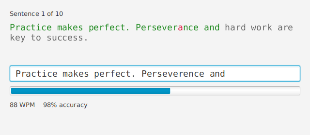

# TypeTrainer

[](https://github.com/FuaadBashi/TypeTrainer-JavaFX/actions/workflows/ci.yml)

A JavaFX typing trainer. Type each practice sentence exactly: every character turns green or red
as you go, and live words-per-minute and accuracy show how you're doing.

<p align="center"></p>

## Highlights

- **Logic separate from the UI.** `TypingSession` scores the input and knows nothing about
  JavaFX. It reports each character's state, progress, completion, WPM and accuracy. The JavaFX
  `App` just renders it.
- **Honest metrics.** WPM is *net*: correct characters ÷ 5 per minute, timed from the first
  keystroke. Accuracy counts every keystroke as typed, so a mistake still counts after you
  backspace over it.
- **Testable time.** The session takes its clock as a `Supplier<Instant>`, so speed calculations
  are tested exactly.
- **Lightweight rendering.** Highlighting uses a `TextFlow` of coloured `Text` nodes rather than
  an embedded browser.
- **Runs anywhere.** Practice sentences ship as a classpath resource, and the app is a proper
  JPMS module launched with `mvn javafx:run`.

## Getting started

Requires JDK 17+ and Maven. JavaFX is downloaded as a Maven dependency.

```bash
git clone https://github.com/FuaadBashi/TypeTrainer-JavaFX.git
cd TypeTrainer-JavaFX
mvn javafx:run
```

To practise your own sentences, edit
[`practice-texts.txt`](src/main/resources/typetrainer/practice-texts.txt) (one per line).

## Project structure

```
src/main/java/
├── module-info.java
└── typetrainer/
    ├── App.java              JavaFX window and rendering
    ├── TypingSession.java    per-character scoring, progress, WPM, accuracy
    └── PracticeTexts.java    loads the bundled sentences
src/main/resources/typetrainer/practice-texts.txt
```

## Tests

```bash
mvn verify
```

This runs the JUnit suite and checks formatting with google-java-format.
